# 🚦 CI/CD Security Gates Guide

**Version:** 1.0.0  
**Workflow:** `.github/workflows/ci-cd-gates.yml`  
**Policy:** NO MOCK DATA - 72 Connectors - White-Hat ONLY

---

## 📋 Overview

Lydian-IQ implements **10 security gates** that MUST pass before deployment to production. All gates are automated in the CI/CD pipeline and enforce zero-tolerance policies for:

- ❌ **NO MOCK DATA** in production (CRITICAL GATE)
- ❌ NO unauthorized API access
- ❌ NO critical vulnerabilities
- ❌ NO hardcoded secrets
- ✅ ONLY official APIs, sandbox environments, affiliate feeds

---

## 🚦 Security Gates (10 Gates)

### Gate 1: Code Quality & Linting

**Purpose:** Ensure code meets quality standards

**Checks:**
- ESLint (JavaScript/TypeScript linting)
- TypeScript type check (`tsc --noEmit`)
- Prettier format check
- Import ordering and unused variables

**Failure Criteria:**
- Critical linting errors
- TypeScript compilation errors
- Inconsistent code formatting

**How to Fix:**
```bash
# Run locally before commit
npm run lint
npx tsc --noEmit
npx prettier --write "**/*.{ts,tsx,js,jsx,json,md}"
```

---

### Gate 2: SAST (Static Application Security Testing)

**Tool:** Semgrep  
**Purpose:** Detect security vulnerabilities in source code

**Rule Sets:**
- `p/security-audit` - General security issues
- `p/secrets` - Hardcoded credentials/secrets
- `p/owasp-top-ten` - OWASP Top 10 vulnerabilities
- `p/react` - React-specific security issues
- `p/typescript` - TypeScript security patterns
- `p/nodejs` - Node.js security issues

**Failure Criteria:**
- Critical or high-severity security issues
- Hardcoded API keys/secrets detected
- SQL injection vulnerabilities
- XSS vulnerabilities

**How to Fix:**
```bash
# Run locally
npx semgrep --config "p/security-audit" --config "p/secrets"
```

---

### Gate 3: Dependency Vulnerability Scanning

**Tools:** npm audit + OSV Scanner  
**Purpose:** Detect vulnerabilities in dependencies

**Checks:**
- npm audit (critical + high severity)
- OSV Scanner (comprehensive CVE database)
- Known malicious packages
- Outdated dependencies with fixes available

**Thresholds:**
- ❌ **GATE FAILS:** Critical vulnerabilities > 0
- ⚠️ **WARNING:** High vulnerabilities > 5

**How to Fix:**
```bash
# Check vulnerabilities
npm audit

# Fix automatically (if possible)
npm audit fix

# Review high/critical issues manually
npm audit --json | jq '.vulnerabilities | to_entries[] | select(.value.severity == "critical" or .value.severity == "high")'

# Update specific package
npm update package-name

# OSV Scanner
curl -L https://github.com/google/osv-scanner/releases/download/v1.4.3/osv-scanner_1.4.3_linux_amd64 -o osv-scanner
chmod +x osv-scanner
./osv-scanner --lockfile=package-lock.json
```

---

### Gate 4: SBOM Generation & SLSA Attestation

**Tools:** CycloneDX + SLSA Framework  
**Purpose:** Software Bill of Materials + Supply Chain Security

**Generates:**
- `sbom.json` (CycloneDX format)
- `sbom.spdx.json` (SPDX format)
- SLSA Provenance (L3 attestation)

**Checks:**
- SBOM completeness (>= 100 components expected)
- All dependencies documented
- License compliance
- Provenance attestation signed

**How to Generate Locally:**
```bash
# CycloneDX SBOM
npx @cyclonedx/cyclonedx-npm --output-file sbom.json

# SPDX SBOM
npx @cyclonedx/cyclonedx-npm --output-format spdx --output-file sbom.spdx.json

# View SBOM
jq '.components | length' sbom.json
```

---

### Gate 5: Mock Data Detection (CRITICAL)

**Status:** 🔴 **CRITICAL GATE** - Failure blocks deployment  
**Purpose:** Enforce NO MOCK DATA policy

**Detection Patterns:**
```javascript
// Source code scan (forbid in production)
/(import|require).*['"].*mock/
/source:\s*['"]mock['"]/
/(fixture|seed|fake|dummy)Data/

// Sample data scan (contract tests)
{ source: 'mock' }
{ _test: true }
{ _mock: true }
```

**Failure Criteria:**
- Mock imports/requires in production code (outside tests/)
- Mock data source markers
- Fixture/seed/fake/dummy patterns
- Contract test samples without source attribution

**How to Fix:**
```bash
# Scan for mock patterns locally
git grep -E "(import|require).*['\"].*mock" -- '*.ts' '*.tsx' '*.js' '*.jsx' ':!tests/' ':!*.spec.*' ':!*.test.*'

# Run contract tests mock detection
npm test -- tests/contract/connectors.contract.spec.ts -t "Mock Data Detection"

# Verify sample source attribution
for file in tests/contract/samples/*.json; do
  jq -e '._source and ._url' "$file" || echo "Missing attribution: $file"
done
```

**Remediation:**
1. Remove all mock data from production code
2. Use official vendor samples for contract tests
3. Add source attribution to all samples:
```json
{
  "_source": "Official Vendor Name",
  "_url": "https://vendor.com/api/docs/sample",
  "_date_retrieved": "2025-10-10",
  "data": { ... }
}
```

---

### Gate 6: Contract Tests (Official Samples Only)

**Purpose:** Validate connectors with official vendor samples

**Checks:**
- All 72 connectors have contract tests
- Schema validation passes
- NO MOCK data in samples
- Source attribution present

**Coverage Requirements:**
- ✅ Passing: >= 50% (36/72 connectors)
- ⏳ Pending samples: Documented with sourceURL

**How to Run:**
```bash
# All connectors
npm test -- tests/contract/connectors.contract.spec.ts

# Specific region
npm test -- tests/contract/connectors.contract.spec.ts -t "TURKEY"

# Mock detection only
npm test -- tests/contract/connectors.contract.spec.ts -t "Mock Data Detection"
```

**Documentation:** `/tests/contract/README.md`

---

### Gate 7: Unit & Integration Tests

**Purpose:** Verify application logic and integrations

**Checks:**
- Unit tests passing
- Integration tests passing
- Code coverage >= 70%
- No test failures

**How to Run:**
```bash
# All tests with coverage
npm test -- --coverage --testPathIgnorePatterns=e2e --testPathIgnorePatterns=contract

# Watch mode
npm test -- --watch

# Coverage report
npm test -- --coverage && open coverage/lcov-report/index.html
```

---

### Gate 8: Security Configuration

**Purpose:** Verify security settings and configurations

**Checks:**
- ✅ SSRF allowlist present (`connector-hosts.json`)
- ✅ All 72 connectors documented
- ✅ NO hardcoded secrets in code
- ✅ Environment variables documented in `.env.example`

**Failure Criteria:**
- SSRF allowlist missing or incomplete
- Hardcoded API keys/secrets detected
- Required environment variables not documented

**How to Verify:**
```bash
# Check SSRF allowlist
cat services/gateway/src/allowlist/connector-hosts.json | jq '.metadata.total_connectors'

# Scan for hardcoded secrets
git grep -E "(password|secret|api[_-]?key|token)\s*=\s*['\"][^'\"]+['\"]" -- '*.ts' '*.tsx' '*.js' '*.jsx' ':!tests/' ':!*.md'

# Verify .env.example
grep -E "^[A-Z_]+=" .env.example
```

---

### Gate 9: Performance Budget

**Purpose:** Prevent bundle size bloat and performance regression

**Budgets:**
- Main bundle: < 500KB
- Vendor bundle: < 1MB
- Total page size: < 2MB

**Checks:**
- Build output size analysis
- Bundle size trends
- Lighthouse score >= 95 (production)

**How to Check Locally:**
```bash
# Build and analyze
npm run build

# Check bundle sizes
du -h dist/**/*.js | sort -h

# Lighthouse (production URL)
npx lighthouse https://ailydian.com --output=html --output-path=./lighthouse-report.html
```

---

### Gate 10: DAST (Dynamic Application Security Testing)

**Tool:** OWASP ZAP Baseline Scan  
**Purpose:** Find security vulnerabilities in running application

**Checks:**
- SQL injection
- XSS vulnerabilities
- CSRF protection
- Security headers (X-Frame-Options, CSP, etc.)
- Mixed content issues
- Cookie security (HttpOnly, Secure, SameSite)

**Configuration:** `.zap/rules.tsv`

**Runs:** Only on `main` branch push (not PRs)

**How to Run Locally:**
```bash
# Start application
npm start &

# Run ZAP baseline scan
docker run -t owasp/zap2docker-stable zap-baseline.py \
  -t http://localhost:3000 \
  -r zap-report.html
```

---

## 🚀 Deployment Flow

```mermaid
graph TD
    A[Push to main] --> B{Gate 1: Code Quality}
    B -->|Pass| C{Gate 2: SAST}
    C -->|Pass| D{Gate 3: Dependency Scan}
    D -->|Pass| E{Gate 4: SBOM/SLSA}
    E -->|Pass| F{Gate 5: Mock Detection}
    F -->|Fail| Z[🚫 DEPLOYMENT BLOCKED]
    F -->|Pass| G{Gate 6: Contract Tests}
    G -->|Pass| H{Gate 7: Unit/Integration}
    H -->|Pass| I{Gate 8: Security Config}
    I -->|Pass| J{Gate 9: Performance Budget}
    J -->|Pass| K{Gate 10: DAST}
    K -->|Pass| L[✅ ALL GATES PASSED]
    L --> M[🔐 Manual Approval Required]
    M -->|Approved| N[🚀 Deploy to Production]
    
    B -->|Fail| P[Fix Issues]
    C -->|Fail| P
    D -->|Fail| P
    E -->|Fail| P
    G -->|Fail| P
    H -->|Fail| P
    I -->|Fail| P
    J -->|Fail| P
    K -->|Fail| P
    P --> A
```



---

## 🔄 Rollback Automation

**Trigger:** Any gate failure on `main` branch

**Actions:**
1. Identify last successful deployment commit
2. Revert to last known good state
3. Trigger Vercel/Azure rollback
4. Notify team (Slack/Discord/Email)

**Manual Rollback:**
```bash
# Find last successful deployment
git log --grep="deploy: success" -1

# Rollback using Vercel CLI
vercel rollback <deployment-url>

# Or revert commit
git revert <commit-sha>
git push origin main
```

---

## 📊 Gate Summary Dashboard

GitHub Actions automatically generates a summary dashboard after each run:

```
🚦 CI/CD Gate Summary

| Gate | Status |
|------|--------|
| 1. Code Quality | ✅ PASSED |
| 2. SAST | ✅ PASSED |
| 3. Dependency Scan | ✅ PASSED |
| 4. SBOM & SLSA | ✅ PASSED |
| 5. Mock Detection (CRITICAL) | ✅ PASSED |
| 6. Contract Tests | ✅ PASSED |
| 7. Unit & Integration Tests | ✅ PASSED |
| 8. Security Config | ✅ PASSED |
| 9. Performance Budget | ✅ PASSED |
| 10. DAST | ⏳ Running... |

✅ ALL GATES PASSED - READY FOR DEPLOYMENT
```

---

## 🛠️ Local Development Checklist

Before pushing to `main`:

```bash
# 1. Code quality
npm run lint
npx tsc --noEmit
npx prettier --write .

# 2. SAST scan
npx semgrep --config "p/security-audit" --config "p/secrets"

# 3. Dependency scan
npm audit
./osv-scanner --lockfile=package-lock.json

# 4. Mock detection
git grep -E "mock|fixture|seed" -- '*.ts' '*.tsx' ':!tests/'
npm test -- tests/contract/connectors.contract.spec.ts -t "Mock Data Detection"

# 5. Contract tests
npm test -- tests/contract/connectors.contract.spec.ts

# 6. Unit tests
npm test -- --coverage

# 7. Security config
cat services/gateway/src/allowlist/connector-hosts.json | jq '.metadata'

# 8. Build
npm run build

# 9. Performance
du -h dist/**/*.js | sort -h
```

---

## 📞 Support

**CI/CD Issues:** devops@ailydian.com  
**Security Concerns:** security@ailydian.com  
**Documentation:** https://github.com/ailydian-ultra-pro/docs/CI-CD-GATES-GUIDE.md

---

**✅ CI/CD Gates - Enforcing Quality, Security, and White-Hat Compliance**
